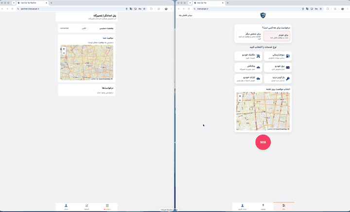
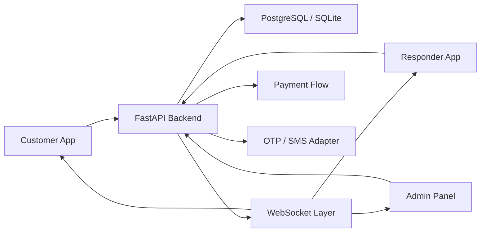

# IranCarYar Portfolio

[](#)
[](#source-code)
[](#tech-stack)

IranCarYar is a roadside assistance MVP designed for customers, responders, and operations teams. This repository is a public portfolio case study for the project. It contains documentation, screenshots, diagrams, and presentation material only.

The production/source repository remains private.



## 30-Second Snapshot

- What it is: a roadside assistance platform for customers, responders, and admins.
- Core value: demonstrates dispatch, role-based workflows, realtime status updates, and mobile-ready UX.
- Engineering focus: FastAPI backend, React/Vite frontend, WebSocket events, database migrations, Docker validation, and AI-assisted project documentation.
- Public scope: portfolio documentation only; the full source repository remains private.

## Overview

IranCarYar models a complete roadside assistance flow:

- Customers request assistance and track progress.
- Responders register, submit documents, receive assignments, and update job status.
- Admin users review responders, assign requests, inspect users, and track payments.
- Realtime updates synchronize customer, responder, and admin views.

## Problem

Roadside assistance products need dispatch reliability, role-based access, location-aware workflows, operational visibility, and mobile-friendly UX. IranCarYar demonstrates the core workflow for that domain without exposing the private source code.

## Features

- Customer onboarding, login, OTP-ready flows, profile, and request history.
- Service request creation and lifecycle tracking.
- Responder onboarding, document review, approval, active jobs, history, and location updates.
- Admin dashboard for responders, customers, requests, and payments.
- Realtime WebSocket event delivery across user roles.
- Local development support with SQLite and staging-style PostgreSQL.
- Docker-based validation path.
- Android shell support through Capacitor.
- AI development documentation for structured project maintenance.

## Tech Stack

- Backend: Python, FastAPI, SQLAlchemy, Alembic, Pydantic, Uvicorn, JWT auth, WebSockets.
- Frontend: React, TypeScript, Vite, Tailwind CSS, Leaflet, Axios, PWA support.
- Mobile shell: Capacitor for Android packaging.
- Database: SQLite for local development, PostgreSQL for deployment-style validation.
- Infrastructure: Docker, Docker Compose, Nginx, GitHub Actions.
- Documentation: Mermaid architecture diagrams, AI development context, release checklist.

## Architecture



See [docs/architecture.md](docs/architecture.md) for the system overview and request lifecycle.

## Screenshots

| Customer Experience |
| --- |
|  |

## Demo

A public hosted demo is not currently available. The GIF preview, screenshot, and muted demo video in this repository were captured from the real project UI running in mock frontend mode.

## Watch Full Demo

The README uses a compressed GIF preview for fast GitHub loading. The full-quality muted MP4 is available here:

[Watch the full IranCarYar demo](docs/demo/iran-car-yar-demo-muted.mp4)

See [docs/demo.md](docs/demo.md) for the available demo material.

## Installation

This public repository is not intended to be installed or run. It is a portfolio case study that intentionally excludes the private backend, frontend, database, and deployment source files.

## Folder Structure

```text
docs/
  architecture.md              System overview and request lifecycle diagrams
  demo.md                      Demo notes and screenshot provenance
  demo/                        GIF preview and full-quality muted MP4
  public-release-checklist.md  Safety checklist for the private source repository
  screenshots/                 Real screenshots captured from the project UI
```

## Source Code

The complete source repository is private. This public repository is intentionally limited to portfolio documentation and presentation assets.

It does not include:

- Backend source code
- Frontend source code
- Database migrations
- Docker Compose files
- Environment files
- Secrets or credentials
- Internal business documents
- Customer or personal data

## AI Development Kit

The private project includes an AI Development Kit with:

- `AI_CONTEXT.md`: a navigation index for AI-assisted development.
- `ai-context/`: generated project documentation for architecture, backend, frontend, API, database, deployment, roadmap, and known issues.
- `ai/`: reusable AI prompts, templates, and workflows for code review, release work, documentation, security audit, and debugging.

Those files are documentation and development aids only. They do not affect runtime behavior.

## Public Release Status

The main `iran-car-yar` source repository remains private. This repository is the public-facing portfolio version and is safe to share with recruiters or hiring managers.
