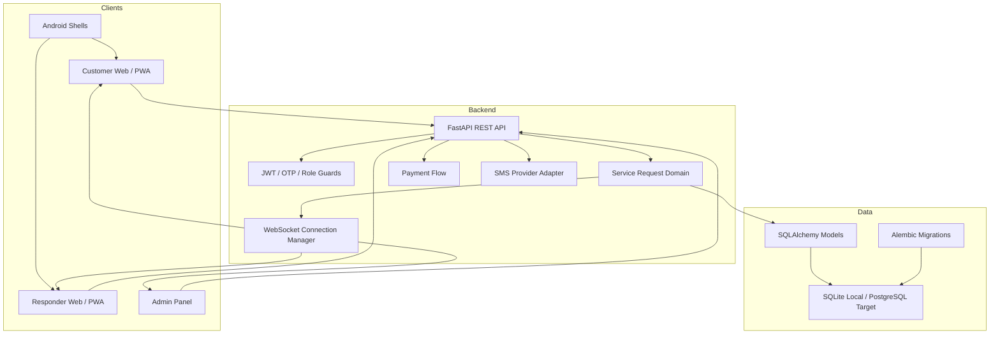
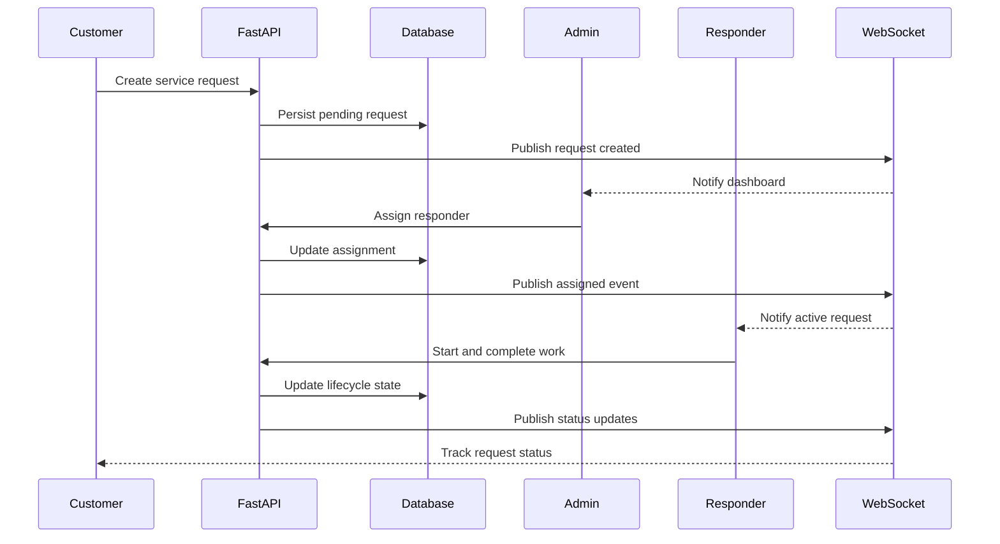
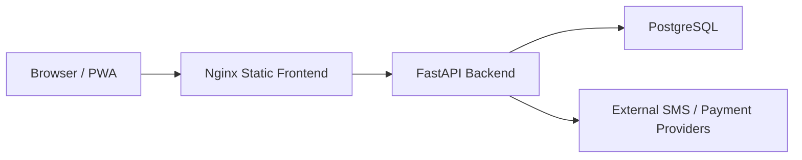

# IranCarYar Architecture

## System Overview

## Request Lifecycle

## Deployment Topology

## Design Notes

- REST endpoints carry customer, responder, and admin workflows.
- WebSocket events keep lifecycle updates synchronized.
- Role guards separate customer, responder, and admin access.
- Alembic owns schema evolution in the private source repository.
- Docker Compose is used as a validation baseline, not as a complete production platform.

